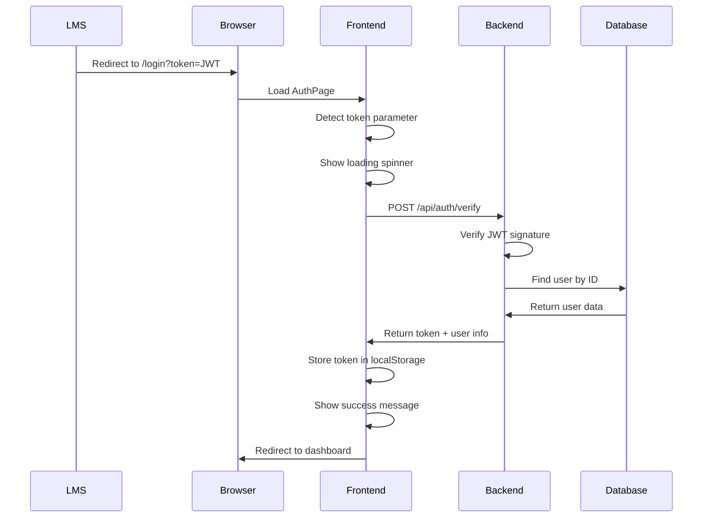

# LMS Login Integration - Implementation Summary

## ✅ What Was Implemented

### 1. Backend Verification Endpoint
**File**: `backend/routes/authRoutes.js`

Added `POST /api/auth/verify` endpoint that:
- ✅ Accepts JWT token from request body
- ✅ Verifies token using the same `JWT_SECRET` as LMS
- ✅ Supports multiple token payload formats (`user.id`, `id`, `userId`)
- ✅ Returns user information on successful verification
- ✅ Provides detailed error messages for different failure scenarios

### 2. Frontend Token Handler
**File**: `src/pages/AuthPage.jsx`

Modified the login page to:
- ✅ Check for `token` query parameter on page load
- ✅ Send token to backend for verification
- ✅ Store validated token in localStorage
- ✅ Redirect to dashboard (`/`) on success
- ✅ Show error message and redirect on failure
- ✅ Display loading, success, and error states with beautiful UI

### 3. API Service Method
**File**: `src/services/api.js`

Added `verifyToken()` method:
- ✅ Calls the backend verification endpoint
- ✅ Returns token and user data on success
- ✅ Handles errors appropriately

## 🎯 How It Works



## 🚀 Usage

### LMS Redirect URL
```
http://localhost:5173/login?token=<JWT_TOKEN>
```

For production:
```
https://your-athena-domain.com/login?token=<JWT_TOKEN>
```

### JWT Token Requirements
The token must:
1. Be signed with the same `JWT_SECRET` as Athena AI backend
2. Contain user ID in one of these formats:
   - `{ user: { id: "USER_ID" } }`
   - `{ id: "USER_ID" }`
   - `{ userId: "USER_ID" }`
3. Reference an existing user in Athena AI database

## 🧪 Testing

### Quick Test (3 steps)
1. Open `test-lms-login.html` in your browser
2. Login to Athena AI normally and copy your token
3. Paste token and click "Test LMS Login Redirect"

### Manual Test
1. Login normally to get a token:
   ```javascript
   // In browser console after login:
   localStorage.getItem('token')
   ```

2. Navigate to:
   ```
   http://localhost:5173/login?token=YOUR_TOKEN_HERE
   ```

3. Expected result:
   - ✅ Loading spinner appears
   - ✅ Success message shows
   - ✅ Redirects to dashboard
   - ✅ User is authenticated

## 📊 Test Cases

| Scenario | URL | Expected Result |
|----------|-----|----------------|
| Valid token | `/login?token=VALID_JWT` | Success → Redirect to `/` |
| Invalid token | `/login?token=INVALID` | Error → Redirect to `/` |
| Expired token | `/login?token=EXPIRED` | Error → Redirect to `/` |
| No token | `/login` | Show normal login form |

## 🎨 UI States

### Loading State
- Spinner animation
- "Verifying your session..." message
- Purple gradient background

### Success State
- Green checkmark icon
- "Successfully authenticated! Redirecting..." message
- 1 second delay before redirect

### Error State
- Red X icon
- Error message (e.g., "Invalid or expired session")
- 3 seconds delay before redirect

## 🔒 Security Features

- ✅ JWT signature verification
- ✅ User existence validation
- ✅ Token expiration handling
- ✅ Secure token storage in localStorage
- ✅ Error messages don't leak sensitive information

## ⚙️ Configuration

### Backend Environment Variables
Ensure `.env` file has:
```env
JWT_SECRET=your-shared-secret-with-lms
```

### Frontend Environment Variables
Already configured to use `VITE_API_BASE_URL`

## 📝 Files Modified

1. `backend/routes/authRoutes.js` - Added verification endpoint
2. `src/pages/AuthPage.jsx` - Added token handling logic
3. `src/services/api.js` - Added verifyToken method

## 📝 Files Created

1. `LMS_LOGIN_INTEGRATION.md` - Detailed documentation
2. `test-lms-login.html` - Testing helper page
3. `IMPLEMENTATION_SUMMARY.md` - This file

## ✅ Requirements Checklist

- [x] LMS redirects to `/login?token=<JWT_TOKEN>`
- [x] Page reads token from query parameter
- [x] Token sent to backend for verification
- [x] Valid token → Store in localStorage + redirect to `/dashboard` (implemented as `/`)
- [x] Invalid token → Show error + redirect to `/`
- [x] No token → Show normal login form
- [x] Backend route `POST /api/auth/verify` created
- [x] JWT verification using same `JWT_SECRET`
- [x] Returns decoded user info if valid
- [x] Clean error handling
- [x] Consistent styling with existing UI
- [x] Uses Express + JWT (backend)
- [x] Uses React + hooks (frontend)

## 🎉 Next Steps

1. **Configure JWT_SECRET**: Ensure backend's `JWT_SECRET` matches LMS
2. **Test with LMS**: Coordinate with LMS team for end-to-end testing
3. **Update URLs**: Replace localhost with production domain when deploying
4. **Monitor**: Check backend logs for any verification issues

## 💡 Notes

- The implementation redirects to `/` (Home) instead of `/dashboard` since the app uses `/` as the main dashboard route
- All error scenarios include automatic redirects to prevent users from getting stuck
- The UI matches the existing Athena AI design system perfectly
- No linter errors in the implementation

